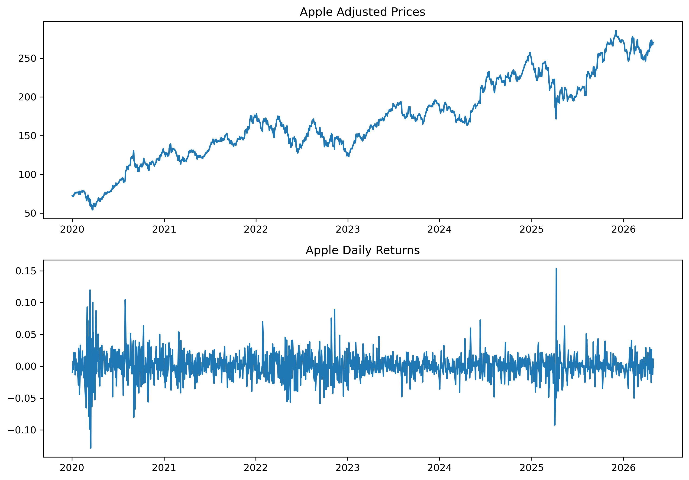

---
kernelspec:
  name: jb2-env
  display_name: Python (jb2-env)
---

# Chapter 2 — Returns and Financial Data

Financial markets generate enormous amounts of time series data.

Every trading day produces new observations on:

- stock prices
- exchange rates
- bond yields
- commodity prices
- cryptocurrency prices
- market indices

But financial analysts rarely work directly with prices alone.

Instead, they usually focus on **returns**.

```{admonition} Central Question
Why do financial analysts study returns rather than prices?
```

This chapter introduces the basic structure of financial data and the logic of financial returns.

We study:

- simple returns
- log returns
- compounding
- adjusted prices
- short selling
- stylized facts of financial returns

We also begin working directly with real financial data using Python and Yahoo Finance.

---

## Learning Objectives

By the end of this chapter, you should be able to:

- distinguish prices from returns
- compute simple and log returns
- explain compounding intuitively
- explain why log returns are useful
- understand adjusted prices
- explain the logic of short selling
- identify stylized facts of financial returns
- download and visualize financial data using Python

---

# 2.1 Financial Prices

A financial price represents the market value of an asset at a particular moment in time.

Examples include:

- stock prices
- exchange rates
- gold prices
- bond prices
- cryptocurrency prices

We often denote the price at time $t$ as:

```{math}
:enumerated: false
P_t
```

For example:

| Day | Price |
|---|---|
| Monday | 100 |
| Tuesday | 103 |
| Wednesday | 101 |

## Why Prices Alone Are Not Enough

Suppose:

- Stock A rises from 10 to 11
- Stock B rises from 100 to 101

Both increased by 1 unit.

But the economic significance is very different.

```{admonition} Key Idea
Financial analysts usually care about percentage changes rather than absolute price changes.
```

This motivates the concept of returns.

---

# 2.2 Simple Returns

For a price series $P_t$, the **simple return** is:

```{math}
:enumerated: false
R_t
=
\frac{P_t-P_{t-1}}{P_{t-1}}
=
\frac{P_t}{P_{t-1}}-1
```

Simple returns measure proportional price change.

## Example

Suppose:

```{math}
:enumerated: false
P_{t-1}=100,
\quad
P_t=105
```

Then:

```{math}
:enumerated: false
R_t
=
\frac{105-100}{100}
=
0.05
```

or:

```{math}
:enumerated: false
5\%
```

```{admonition} Interpretation
A simple return measures proportional price change over a period.
```

---

# 2.3 Positive and Negative Returns

Returns may be positive or negative.

| Price Movement | Return |
|---|---|
| price rises | positive return |
| price falls | negative return |

Example:

```{math}
:enumerated: false
P_{t-1}=100,
\quad
P_t=95
```

Then:

```{math}
:enumerated: false
R_t
=
\frac{95-100}{100}
=
-0.05
```

or:

```{math}
:enumerated: false
-5\%
```

---

# 2.4 Gross Returns

Sometimes it is useful to work with the **gross return**:

```{math}
:enumerated: false
1+R_t
=
\frac{P_t}{P_{t-1}}
```

Examples:

| Simple Return | Gross Return |
|---|---|
| 5% | 1.05 |
| -3% | 0.97 |

Gross returns are especially useful for compounding.

---

# 2.5 Compounding Intuition

Suppose an investment earns:

- 10% in year 1
- 10% in year 2

Starting from:

```{math}
:enumerated: false
100
```

After year 1:

```{math}
:enumerated: false
100(1.10)=110
```

After year 2:

```{math}
:enumerated: false
110(1.10)=121
```

Overall growth is therefore:

```{math}
:enumerated: false
1.10 \times 1.10 = 1.21
```

or:

```{math}
:enumerated: false
21\%
```

```{admonition} Important
Returns compound multiplicatively through time.
```

---

# 2.6 Why You Cannot Simply Average Returns

Consider the following price series:

| Year | Price |
|---|---|
| 2020 | 100 |
| 2021 | 80 |
| 2022 | 100 |

The price:

- falls from 100 to 80
- then rises from 80 back to 100

The simple returns are:

| Period | Return |
|---|---|
| 2021 | -20% |
| 2022 | +25% |

Now notice something interesting:

```{math}
:enumerated: false
-20\% + 25\% = 5\%
```

But the investment did **not** earn 5%.

The final price returned exactly to the starting value.

Total return is therefore:

```{math}
:enumerated: false
0\%
```

```{admonition} Key Insight
Simple returns do not add correctly across time.
```

This is one of the main motivations for log returns.

---

# 2.7 Log Returns

Financial analysts often work with **log returns** instead of simple returns.

The log return is:

```{math}
:enumerated: false
r_t
=
\log\left(\frac{P_t}{P_{t-1}}\right)
```

Equivalently:

```{math}
:enumerated: false
r_t
=
\log(1+R_t)
```

where:

```{math}
:enumerated: false
R_t
=
\frac{P_t-P_{t-1}}{P_{t-1}}
```

denotes the simple return.

## Example

Suppose:

```{math}
:enumerated: false
P_{t-1}=100,
\quad
P_t=105
```

Then:

```{math}
:enumerated: false
r_t
=
\log\left(\frac{105}{100}\right)
\approx 0.04879
```

or approximately:

```{math}
:enumerated: false
4.88\%
```

```{admonition} Observation
For small changes, simple returns and log returns are very similar.
```

---

# 2.8 Why Log Returns Matter

At first glance, log returns may seem unnecessarily complicated.

Why not simply use percentage returns?

The answer lies in compounding.

Suppose returns over multiple periods are:

```{math}
:enumerated: false
R_1,R_2,\dots,R_T
```

The compounded gross return is:

```{math}
:enumerated: false
\prod_{t=1}^{T}(1+R_t)
=
\frac{P_T}{P_0}
```

Taking logs:

```{math}
:enumerated: false
\log\left(
\prod_{t=1}^{T}(1+R_t)
\right)
=
\log\left(
\frac{P_T}{P_0}
\right)
```

Using logarithm rules:

```{math}
:enumerated: false
\sum_{t=1}^{T}\log(1+R_t)
=
\log P_T - \log P_0
```

```{admonition} Key Result
Log returns add across time.
```

This property is called:

```text
time additivity
```

and is one of the main reasons log returns are widely used in finance and econometrics.

---

# 2.9 Simple Returns vs Log Returns

| Feature | Simple Returns | Log Returns |
|---|---|---|
| intuitive | ✓ | |
| additive through time | | ✓ |
| commonly used in finance | ✓ | ✓ |
| natural for continuous compounding | | ✓ |

---

```{admonition} Practical Advice
In practice:

- simple returns are often easier to interpret,
- log returns are often easier to model statistically.
```

---

# 2.10 Small-Return Approximation

For small returns:

```{math}
:enumerated: false
\log(1+R_t)
\approx
R_t
```

This approximation is usually very accurate for daily financial returns.

## Example

| Simple Return | Log Return |
|---|---|
| 1% | 0.995% |
| 5% | 4.88% |
| 10% | 9.53% |

As returns become larger, the difference becomes more important.

```{admonition} Rule of Thumb
For small returns, simple and log returns are very similar.

For larger returns, the distinction becomes more important.
```

---

# 2.11 Long Positions and Short Selling

Most investors profit when prices rise.

This is called a long position.

## Long Position

Buy first, sell later.

Profit if price rises.

## Short Selling

Short selling reverses the logic.

The investor:

1. borrows an asset,
2. sells it,
3. later buys it back.

Profit occurs if the price falls.

## Example

Suppose:

- you short sell at 100
- later repurchase at 90

Profit:

```{math}
:enumerated: false
100 - 90 = 10
```

```{admonition} Important
Short selling allows traders to profit from falling prices.
```

---

## Risk of Short Selling

Losses from a long position are limited because prices cannot fall below zero.

But short-selling losses can theoretically be unlimited if prices rise dramatically.

---

# 2.12 Downloading Financial Data with Python

We now download real financial data using Python.

```python
import yfinance as yf
import matplotlib.pyplot as plt

aapl = yf.download("AAPL", start="2020-01-01", auto_adjust=False)

print(aapl.head())
```

> We use `auto_adjust=False` to get the Adjusted Closing price.

## Understanding the Columns

Yahoo Finance typically provides:

| Variable | Meaning |
|---|---|
| Open | opening price |
| High | highest price |
| Low | lowest price |
| Close | closing price |
| Adj Close | adjusted closing price |
| Volume | trading volume |

---

# 2.13 Adjusted Prices

One of the most important concepts in financial data is the adjusted price.

Stock prices may change because of:

- dividends
- stock splits
- corporate actions

Raw prices therefore may not accurately reflect investor returns.

## Example: A 2-for-1 Stock Split

Suppose a company’s stock price evolves as follows:

| Date | Close Price | Shares Held | Investor Wealth |
|---|---|---|---|
| Day 1 | 100 | 1000 | 100,000 |
| Day 2 | 102 | 1000 | 102,000 |
| Day 3 | 105 | 1000 | 105,000 |

Now suppose the company announces a:

```text
2-for-1 stock split
```

Each shareholder receives:

- twice as many shares,
- but each share is worth half as much.

After the split:

| Date | Close Price | Shares Held | Investor Wealth |
|---|---|---|---|
| Day 4 | 52.5 | 2000 | 105,000 |

Notice:

```{math}
:enumerated: false
52.5 \times 2000 = 105000
```

Investor wealth is unchanged.

```{admonition} Important
A stock split changes the number of shares and the share price mechanically, but it does not change total investor wealth.
```

## Why Raw Prices Become Misleading

If we looked only at raw prices, we might incorrectly conclude that the stock experienced a:

```{math}
:enumerated: false
50\%
```

price crash:

```{math}
:enumerated: false
105 \rightarrow 52.5
```

But this is economically incorrect.

The investor is neither richer nor poorer after the split.

## Adjusted Prices

Adjusted prices correct for stock splits and other corporate actions.

An adjusted price series might therefore look like:

| Date | Close Price | Trader's Quantity | Net Worth | Adjusted Close | Daily Return |
|---|---:|---:|---:|---:|---:|
| Day 1 | 100.0 | 1000 | 100,000 | 50.0 | — |
| Day 2 | 102.0 | 1000 | 102,000 | 51.0 | 2.0% |
| Day 3 | 105.0 | 1000 | 105,000 | 52.5 | 2.9% |
| Day 4 | 52.5 | 2000 | 105,000 | 52.5 | 0.0% |
| Day 5 | 54.0 | 2000 | 108,000 | 54.0 | 2.9% |

Now the artificial price break disappears.


```{admonition} Key Insight
Adjusted prices attempt to measure the true economic return experienced by investors.
```

## Why Adjusted Prices Matter

Using raw prices incorrectly can produce misleading returns.

Most empirical financial analysis therefore uses:

```text
Adjusted Close
```

rather than raw closing prices.

---

# 2.14 Calculating Returns in Python

We now calculate both simple and log returns.

```{code-cell} python
import numpy as np
import pandas as pd

price = [100, 80, 100, 115, 125]
year = [2020, 2021, 2022, 2023, 2024]

df = pd.DataFrame({"price": price}, index=year)

df["simple_return"] = df["price"].pct_change()

df["log_return"] = np.log(
    df["price"] / df["price"].shift(1)
)

df
```

| year | price | simple_return | log_return |
|------|-------|---------------|------------|
| 2020 | 100   | NaN           | NaN        |
| 2021 | 80    | -0.200000     | -0.223144  |
| 2022 | 100   | 0.250000      | 0.223144   |
| 2023 | 115   | 0.150000      | 0.139762   |
| 2024 | 125   | 0.086957      | 0.083382   |

---

# 2.15 Cumulative Returns

To compute cumulative growth from simple returns, we compound.

```{code-cell} python
cum_gross = (df["simple_return"] + 1).cumprod()

cum_gross
```

| year | cumulative returns |
|------|---------------|
| 2020 | NaN           |
| 2021 | 0.80          |
| 2022 | 1.00          |
| 2023 | 1.15          |
| 2024 | 1.25          |


---

## Cumulative Log Returns

With log returns, we simply add.

```{code-cell} python
cum_log = df["log_return"].cumsum()

cum_log
```

| year | cumulative log_return        |
|------|-------------------|
| 2020 | NaN               |
| 2021 | -0.2231436     |
| 2022 | 5.551115e-17      |
| 2023 | 0.1397619      |
| 2024 | 0.2231436      |


---

## Consistency Check

The cumulative log return should equal:

```{math}
:enumerated: false
\log P_T - \log P_0
```

We verify this directly.

```{code-cell} python
np.log(df["price"].iloc[-1]) - np.log(df["price"].iloc[0])
```
`np.float64(0.2231435513142097)`

## Returning to Gross Returns

Exponentiating cumulative log returns recovers total growth.

```{code-cell} python
np.exp(cum_log.iloc[-1])
```

`np.float64(1.25)`

```{admonition} Interpretation
Exponentiating cumulative log returns converts them back into compounded gross returns.
```

---

# 2.16 Stylized Facts of Financial Returns

Financial returns display several recurring empirical patterns.

These are called stylized facts.

## Stylized Fact 1: Returns Are Noisy

Asset returns fluctuate substantially from day to day.

Short-run movements are often difficult to predict.


## Stylized Fact 2: Volatility Clustering

Large movements tend to cluster together.

Calm periods are followed by calm periods.

Volatile periods are followed by volatile periods.

```{admonition} Important
Volatility itself often displays persistence.
```

This observation motivates ARCH and GARCH models later in the book.

## Stylized Fact 3: Fat Tails

Extreme movements occur more often than predicted by the normal distribution.

Examples include:

- financial crashes
- sudden rallies
- market panics

```{admonition} Key Idea
Financial returns often display more extreme observations than standard textbook models predict.
```

## Stylized Fact 4: Asymmetry

Financial markets sometimes fall faster than they rise.

Negative shocks may generate stronger volatility responses than positive shocks.

# 2.17 Example: Comparing Prices and Returns

```{code-cell} python
import yfinance as yf
import matplotlib.pyplot as plt

aapl = yf.download("AAPL", start="2020-01-01", auto_adjust=False)

prices = aapl["Adj Close", "AAPL"]

returns = prices.pct_change()

fig, ax = plt.subplots(2,1, figsize=(10,7))

ax[0].plot(prices)
ax[0].set_title("Apple Adjusted Prices")

ax[1].plot(returns)
ax[1].set_title("Apple Daily Returns")

plt.tight_layout()

plt.savefig("figs/ch2/aapl.png", dpi=300, bbox_inches="tight")
plt.close()   # replace with plt.show()
```




---

```{admonition} Discussion
Prices often display trends.

Returns usually fluctuate around a relatively stable mean close to zero.
```

---

# 2.18 Gretl Example: Importing Financial Data

Gretl can import financial datasets directly from CSV or Excel files.

## Step 1: Download Data

Download data from Yahoo Finance as CSV.

---

```markdown
[GRETL Screenshot Placeholder: Yahoo Finance download page]
```

---

## Step 2: Import into GRETL

Menu:

`File → Open data → Import`

Choose the downloaded CSV file.

---

```markdown
[GRETL Screenshot Placeholder: GRETL import window]
```

---

## Step 3: Plot the Series

Select the variable and choose:

`Variable → Time series plot`

---

```markdown
[GRETL Screenshot Placeholder: Financial time series plot]
```

---

# 2.19 Common Mistakes

```{admonition} Common Mistakes
:class: warning

**1. Using raw prices instead of adjusted prices**  
Corporate actions can distort returns.

**2. Confusing returns with price changes**  
Returns are proportional changes.

**3. Forgetting compounding**  
Returns accumulate multiplicatively.

**4. Ignoring volatility clustering**  
Financial volatility is rarely constant.

**5. Assuming normality blindly**  
Financial returns often exhibit fat tails.
```

---

# 2.20 Looking Ahead

This chapter introduced the foundations of financial time series data.

In the next chapter, we briefly review key ideas from probability and statistics that will be useful throughout the book.

We will study:

- randomness
- probability distributions
- sampling intuition
- hypothesis testing
- statistical uncertainty

# Key Takeaways

```{admonition} Summary
- Financial analysts usually focus on returns rather than prices.
- Simple returns measure proportional price changes.
- Log returns are additive through time and useful statistically.
- Returns compound multiplicatively.
- Adjusted prices are crucial in empirical finance.
- Short selling allows traders to profit from falling prices.
- Financial returns display volatility clustering and fat tails.
- Python and Yahoo Finance provide easy access to real financial data.
```

---

# Appendix 2A — A More Technical Look at Log Returns

This appendix provides a slightly more formal explanation of why log returns are so important in finance and econometrics.

---

# A.1 Continuous Compounding

Suppose wealth evolves according to:

```{math}
:enumerated: false
W_t
=
W_0 e^{rt}
```

where:

- $r$ is the continuously compounded rate of return
- $e$ is the exponential function

Taking logs:

```{math}
:enumerated: false
\log W_t
=
\log W_0 + rt
```

Thus:

```{math}
:enumerated: false
r
=
\frac{\log W_t - \log W_0}{t}
```

This motivates the use of log returns as continuously compounded growth rates.

---

# A.2 Additivity Through Time

Suppose:

```{math}
:enumerated: false
P_0 \rightarrow P_1 \rightarrow P_2
```

Then:

```{math}
:enumerated: false
r_1
=
\log\left(\frac{P_1}{P_0}\right)
```

and:

```{math}
:enumerated: false
r_2
=
\log\left(\frac{P_2}{P_1}\right)
```

Adding:

```{math}
:enumerated: false
r_1+r_2
=
\log\left(\frac{P_1}{P_0}\right)
+
\log\left(\frac{P_2}{P_1}\right)
```

Using logarithm rules:

```{math}
:enumerated: false
r_1+r_2
=
\log\left(\frac{P_2}{P_0}\right)
```

Thus log returns aggregate exactly across time.

---

# A.3 Connection to Statistical Models

Many financial models assume:

```{math}
:enumerated: false
\log P_t
```

follows a stochastic process.

For example:

```{math}
:enumerated: false
\log P_t
=
\log P_{t-1}
+
\mu
+
w_t
```

where:

- $\mu$ is average growth
- $w_t$ is a random shock

Taking first differences gives:

```{math}
:enumerated: false
\log P_t - \log P_{t-1}
=
\mu + w_t
```

which is simply:

```{math}
:enumerated: false
r_t
=
\mu + w_t
```

This shows why log returns naturally appear in many time series and financial models.

---

```{admonition} Looking Ahead
Later chapters will model returns directly using:
- AR models,
- volatility models,
- random walks,
- and stochastic processes.
```

# Appendix 2B — Adjusted Prices and Total Returns

Raw stock prices can be misleading because firms may:

- pay dividends,
- split shares,
- issue bonus shares,
- undertake corporate actions.

Adjusted prices attempt to correct for these changes.

---

## Dividends

Suppose:

- stock price yesterday: 100
- dividend paid today: 2
- observed price today: 98

The investor is not necessarily worse off.

The dividend compensates for part of the price decline.

---

## Stock Splits

Suppose a 2-for-1 stock split occurs.

The stock price may mechanically change:

```{math}
:enumerated: false
100 \rightarrow 50
```

while the number of shares doubles.

Economic wealth is unchanged.

---

## Total Return Perspective

Adjusted prices attempt to measure:

```text
capital gains + reinvested dividends
```

This gives a better measure of investor performance.

---

```{admonition} Practical Advice
For most empirical financial analysis, use adjusted closing prices whenever possible.
```

---

# Appendix 2C — Returns with Long and Short Positions

In practice, trading strategies often switch between:

- long positions,
- short positions,
- and neutral positions.

Returns therefore depend not only on price movements, but also on the trading position.

## Example: Long to Short Position

Suppose a trader initially buys a stock at:

```{math}
:enumerated: false
100
```

and later sells at:

```{math}
:enumerated: false
103
```

The return is:

```{math}
:enumerated: false
\frac{103-100}{100}
=
0.03
```

or:

```{math}
:enumerated: false
3\%
```

Now suppose the trader opens a short position at:

```{math}
:enumerated: false
103
```

and later closes the short position at:

```{math}
:enumerated: false
98
```

The return becomes:

```{math}
:enumerated: false
\frac{103-98}{103}
\approx
0.0485
```

or approximately:

```{math}
:enumerated: false
4.9\%
```

```{admonition} Important
For short positions, profits occur when prices fall.
```

## Tracking Positions Through Time

Trading systems often maintain a position variable:

| Position | Meaning |
|---|---|
| +1 | long |
| 0 | no position |
| -1 | short |

Returns therefore depend jointly on:

- price changes,
- position direction,
- and trade timing.

## Why This Matters

Correct return calculation becomes especially important in:

- backtesting,
- algorithmic trading,
- trading indicators,
- portfolio analysis.

Incorrect handling of short positions can produce misleading performance measures.