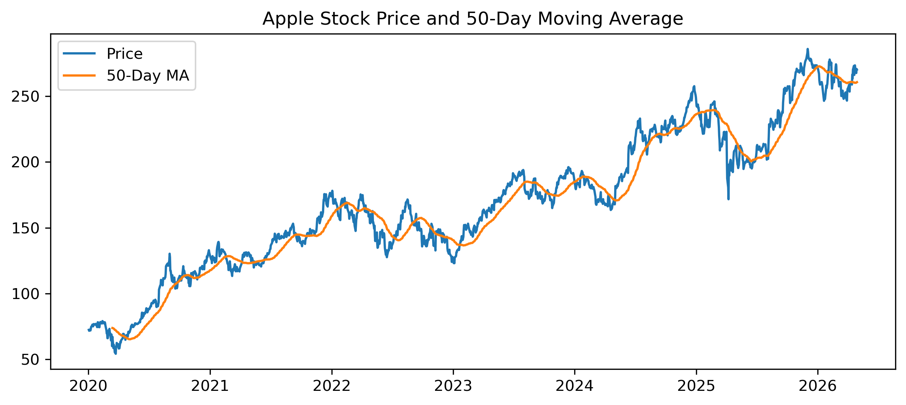
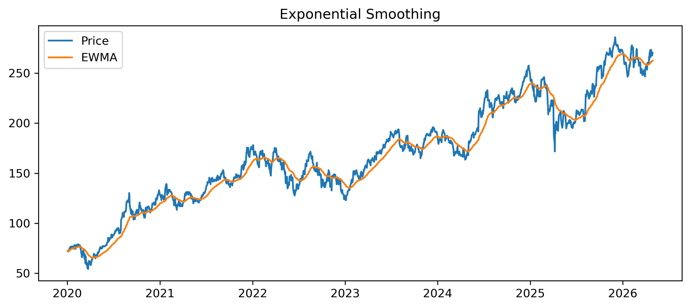
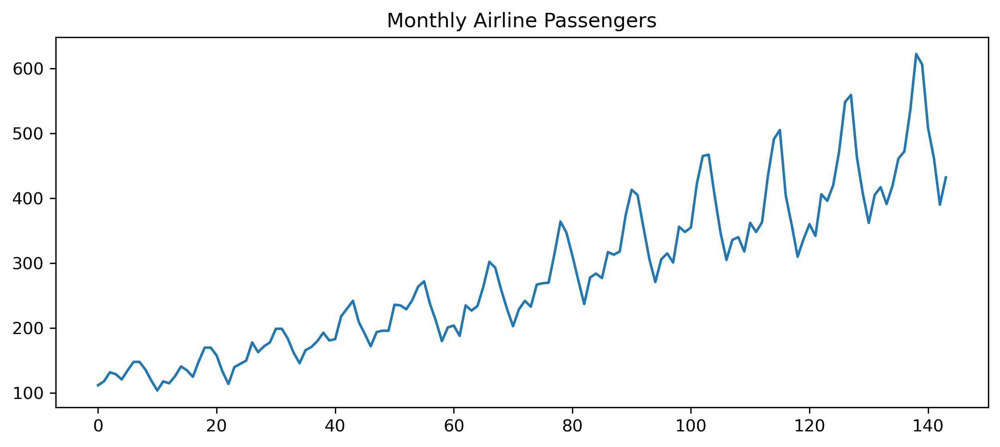
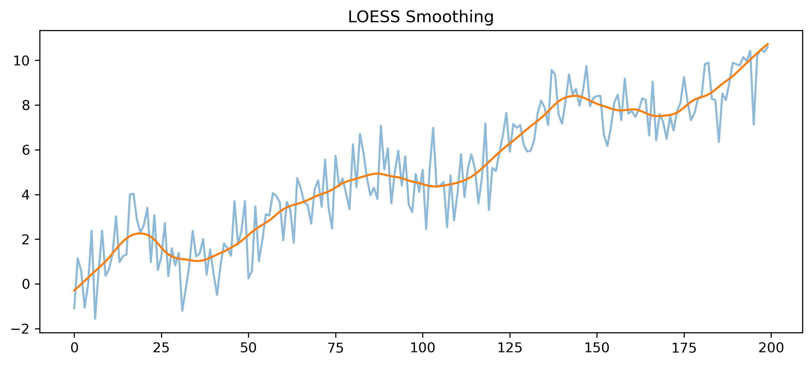
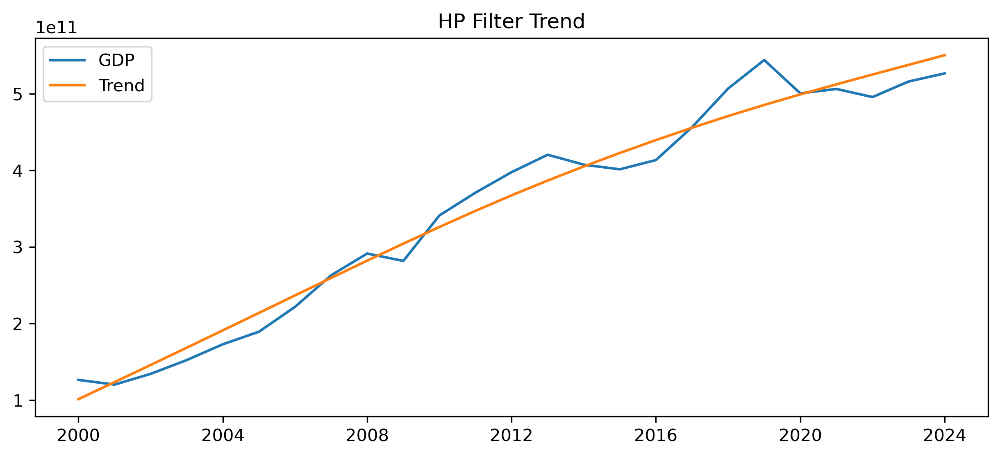

---
kernelspec:
  name: jb2-env
  display_name: Python (jb2-env)
---

# Chapter 5 — Smoothing and Trend Estimation

Real-world time series are often noisy.

Daily stock prices fluctuate constantly.

Macroeconomic indicators rise and fall irregularly.

Even when underlying trends exist, short-run variation can obscure them.

One of the central goals of time series analysis is therefore:

```{admonition} Central Question
How can we separate long-run structure from short-run noise?
```

This chapter introduces several important smoothing and trend estimation methods.

We study:

- moving averages,
- exponential smoothing,
- Holt and Holt–Winters methods,
- LOESS smoothing,
- splines,
- the HP filter,
- and the bias–variance trade-off.

The emphasis throughout is intuition-first and applications-oriented.

---

## Learning Objectives

By the end of this chapter, you should be able to:

- explain the purpose of smoothing
- distinguish signal from noise
- construct moving averages
- understand exponential smoothing intuitively
- explain Holt and Holt–Winters methods
- understand local smoothing methods such as LOESS
- interpret HP-filter trends
- understand the bias–variance trade-off
- apply smoothing methods using Python and GRETL

---

# 5.1 Why Smooth Data?

Many time series contain substantial short-run noise.

Examples include:

- daily stock returns,
- exchange rates,
- cryptocurrency prices,
- high-frequency macroeconomic indicators.

Random fluctuations can make it difficult to see broader patterns.

```{admonition} Key Idea
Smoothing attempts to reveal underlying structure by reducing short-run fluctuations.
```

---

# 5.2 Signal and Noise

A useful conceptual framework is:

```{math}
:enumerated: false
\text{Observed Series}
=
\text{Signal}
+
\text{Noise}
```

where:

- signal = meaningful structure,
- noise = random fluctuations.

## Example

Suppose stock prices fluctuate daily because of:

- random news,
- speculation,
- temporary shocks.

Despite this noise, the market may still exhibit:

- long-run trends,
- business cycles,
- persistent movements.

Smoothing attempts to recover these underlying components.

---

# 5.3 Moving Averages

One of the simplest smoothing methods is the moving average.

A moving average replaces each observation with an average of nearby observations.

## Simple Moving Average

A $k$-period moving average is:

```{math}
:enumerated: false
MA_t
=
\frac{1}{k}
\sum_{i=0}^{k-1}x_{t-i}
```

where:

- $k$ = window length,
- $x_t$ = observed series.

```{admonition} Intuition
Moving averages smooth fluctuations by averaging neighboring observations.
```

---

# 5.4 Example: 5-Day Moving Average

Suppose stock prices are:

| Day | Price |
|---|---|
| 1 | 100 |
| 2 | 102 |
| 3 | 101 |
| 4 | 104 |
| 5 | 103 |

The 5-day moving average is:

```{math}
:enumerated: false
\frac{100+102+101+104+103}{5}
=
102
```

---

# 5.5 Moving Averages in Python

We now compute a moving average using Python.

```{code-cell} python
import yfinance as yf
import matplotlib.pyplot as plt

aapl = yf.download("AAPL", start="2020-01-01", auto_adjust=False)

prices = aapl["Adj Close"]

ma50 = prices.rolling(50).mean()

plt.figure(figsize=(10,4))

plt.plot(prices, label="Price")

plt.plot(ma50, label="50-Day MA")

plt.legend()

plt.title("Apple Stock Price and 50-Day Moving Average")

plt.savefig("figs/ch5/MA.png", dpi=300, bbox_inches="tight")
plt.close()   # replace with plt.show()
```



```{admonition} Observation
The moving average smooths short-run fluctuations and reveals the broader trend more clearly.
```

---

# 5.6 Choosing the Window Length

The smoothing effect depends heavily on the window length.

## Small Window

- responds quickly,
- less smooth,
- more sensitive to noise.

## Large Window

- smoother,
- slower response,
- may miss turning points.

```{admonition} Important
Smoothing involves a trade-off between responsiveness and smoothness.
```

---

# 5.7 Moving Averages as Filters

Moving averages act as filters.

They suppress:

- high-frequency fluctuations,
- short-run noise.

At the same time, they preserve:

- lower-frequency movements,
- trends,
- cycles.

```{admonition} Looking Ahead
Later chapters will interpret many time series methods as filters.
```

This becomes especially important in:

- spectral analysis,
- trading indicators,
- signal extraction.

---

# 5.8 Exponential Smoothing

Moving averages assign equal weight to all observations inside the window.

Exponential smoothing instead assigns:

- larger weights to recent observations,
- smaller weights to older observations.

## Simple Exponential Smoothing

The updating equation is:

```{math}
:enumerated: false
\hat x_{t+1}
=
\alpha x_t
+
(1-\alpha)\hat x_t
```

where:

- $0<\alpha<1$,
- $\alpha$ controls responsiveness.

```{admonition} Intuition
Exponential smoothing gradually discounts older information.
```

---

# 5.9 Interpreting the Smoothing Parameter

The parameter:

```{math}
:enumerated: false
\alpha
```

controls how quickly the model reacts to new information.

## Large $\alpha$

- reacts quickly,
- more sensitive to recent changes,
- less smooth.

## Small $\alpha$

- smoother,
- reacts slowly,
- emphasizes long-run behavior.

---

# 5.10 Exponential Smoothing in Python

```{code-cell} python
import yfinance as yf
import matplotlib.pyplot as plt

aapl = yf.download("AAPL", start="2020-01-01", auto_adjust=False)

prices = aapl["Adj Close"]

ewma = prices.ewm(span=50).mean()

plt.figure(figsize=(10,4))

plt.plot(prices, label="Price")

plt.plot(ewma, label="EWMA")

plt.legend()

plt.title("Exponential Smoothing")

plt.savefig("figs/ch5/ema.png", dpi=300, bbox_inches="tight")
plt.close()   # replace with plt.show()
```



```{admonition} Observation
Exponential smoothing reacts more quickly to recent changes than a simple moving average.
```

---

# 5.11 Forecasting Interpretation

Exponential smoothing is not only a smoothing method.

It is also a forecasting method.

The smoothed series itself becomes a forecast of future values.

```{admonition} Important
Many smoothing methods are simultaneously forecasting methods.
```

---

# 5.12 Holt’s Method

Simple exponential smoothing works best when no trend exists.

But many economic time series trend through time.

Holt’s method extends exponential smoothing by modeling:

- level,
- and trend.

## Holt Updating Equations

### Level

```{math}
:enumerated: false
\ell_t
=
\alpha x_t
+
(1-\alpha)(\ell_{t-1}+b_{t-1})
```

### Trend

```{math}
:enumerated: false
b_t
=
\beta(\ell_t-\ell_{t-1})
+
(1-\beta)b_{t-1}
```

```{admonition} Key Idea
Holt’s method smooths both the current level and the trend.
```

---

# 5.13 Holt–Winters Method

Some time series contain:

- trend,
- and seasonality.

Holt–Winters methods extend Holt’s method further to model seasonal structure.

Examples include:

- tourism,
- electricity demand,
- retail sales.

```{admonition} Definition
Holt–Winters methods combine:
- smoothing,
- trend estimation,
- and seasonal adjustment.
```

---

# 5.14 Example: Seasonal Data

```{code-cell} python
import pandas as pd
import matplotlib.pyplot as plt

url = "https://raw.githubusercontent.com/jbrownlee/Datasets/master/airline-passengers.csv"

df = pd.read_csv(url)

df["Passengers"].plot(figsize=(10,4))

plt.title("Monthly Airline Passengers")

plt.savefig("figs/ch5/airline.png", dpi=300, bbox_inches="tight")
plt.close()   # replace with plt.show()
```



```{admonition} Observation
The series displays:
- trend,
- seasonality,
- and changing variation.
```

---

# 5.15 Local Smoothing: LOESS

LOESS (Locally Weighted Scatterplot Smoothing) is a flexible smoothing method.

Instead of fitting one global trend, LOESS fits:

- many local regressions.

---

```{admonition} Intuition
LOESS adapts flexibly to local structure in the data.
```

This makes LOESS useful when trends change gradually over time.

---

# 5.16 LOESS Example in Python

```{code-cell} python
import numpy as np
import matplotlib.pyplot as plt
from statsmodels.nonparametric.smoothers_lowess import lowess

np.random.seed(123)

x = np.arange(200)

y = (
    0.05*x
    + np.sin(x/10)
    + np.random.normal(scale=1,size=200)
)

smooth = lowess(y, x, frac=0.1)

plt.figure(figsize=(10,4))

plt.plot(x, y, alpha=0.5)

plt.plot(smooth[:,0], smooth[:,1])

plt.title("LOESS Smoothing")

plt.savefig("figs/ch5/loess.png", dpi=300, bbox_inches="tight")
plt.close()   # replace with plt.show()
```



---

# 5.17 Splines

Splines approximate a series using connected polynomial segments.

They provide flexible smooth curves while avoiding excessive instability.

```{admonition} Definition
Splines are piecewise polynomial functions joined smoothly at specific points called knots.
```

---

# 5.18 The Hodrick–Prescott (HP) Filter

The HP filter is widely used in macroeconomics.

It decomposes a series into:

- trend,
- and cyclical components.

## Decomposition

```{math}
:enumerated: false
x_t
=
\tau_t
+
c_t
```

where:

- $\tau_t$ = trend,
- $c_t$ = cycle.

```{admonition} Important
The HP filter attempts to separate long-run growth from short-run fluctuations.
```

---

# 5.19 HP Filter Example

```{code-cell} python
import pandas_datareader.data as web
import matplotlib.pyplot as plt
from statsmodels.tsa.filters.hp_filter import hpfilter

gdp = web.DataReader(
    "MKTGDPTHA646NWDB",
    "fred",
    start="2000-01-01"
)

cycle, trend = hpfilter(gdp.squeeze(), lamb=400)

plt.figure(figsize=(10,4))

plt.plot(gdp, label="GDP")

plt.plot(trend, label="Trend")

plt.legend()

plt.title("HP Filter Trend")

plt.savefig("figs/ch5/hp.png", dpi=300, bbox_inches="tight")
plt.close()   # replace with plt.show()
```



---

# 5.20 The Smoothing Parameter in the HP Filter

The HP filter uses a parameter:

```{math}
:enumerated: false
\lambda
```

which controls smoothness.


## Large $\lambda$

- smoother trend,
- less sensitivity to fluctuations.

## Small $\lambda$

- more flexible trend,
- follows data more closely.

```{admonition} Important
All smoothing methods involve trade-offs between flexibility and smoothness.
```

---

# 5.21 The Bias–Variance Trade-Off

Smoothing always involves compromise.

## Too Little Smoothing

- noisy estimates,
- overreaction,
- high variance.

## Too Much Smoothing

- important movements disappear,
- turning points may be missed,
- high bias.

```{admonition} Key Idea
The bias–variance trade-off is central in statistics, forecasting, and machine learning.
```

---

# 5.22 Smoothing and Forecasting

Smoothing methods are often used as forecasting tools.

Examples include:

- demand forecasting,
- inventory management,
- volatility estimation,
- macroeconomic trend extraction.

```{admonition} Practical Advice
Simple smoothing methods often perform surprisingly well in forecasting applications.
```

---

# 5.23 Adjusted Prices and Trend Analysis

When working with financial prices, smoothing should usually be applied to:

```text
Adjusted Close
```

rather than raw prices.

```{admonition} Important
Corporate actions such as stock splits may distort trends if raw prices are used.
```

This becomes especially important in:

- moving averages,
- trend-following strategies,
- backtesting.

---

# 5.24 Smoothing and Trading Indicators

Many popular trading indicators are essentially smoothing methods.

Examples include:

- moving average crossover systems,
- MACD,
- Bollinger Bands.

```{admonition} Looking Ahead
The next chapter studies trading indicators as filters and smoothing devices.
```

---

# 5.25 Gretl Example: Moving Averages

Gretl provides simple tools for smoothing.

---

## Step 1 — Open Data

Load a time series dataset.

---

## Step 2 — Plot Series

Menu:

```text
Variable → Time series plot
```

---

## Step 3 — Add Moving Average

Menu:

```text
Add → Moving average
```

Choose the window length.

---

```markdown
[GRETL Screenshot Placeholder: Moving average dialog]
```

---

# 5.26 Gretl Example: HP Filter

Menu:

```text
Variable → Filter → Hodrick-Prescott
```

Choose:

- smoothing parameter,
- trend extraction options.

---

```markdown
[GRETL Screenshot Placeholder: HP filter output]
```

---

# 5.27 Common Mistakes

```{admonition} Common Mistakes
:class: warning

**1. Oversmoothing**  
Too much smoothing may hide important dynamics.

**2. Overreacting to noise**  
Too little smoothing may produce unstable signals.

**3. Ignoring structural breaks**  
Trends may change abruptly over time.

**4. Using raw instead of adjusted prices**  
Corporate actions can distort financial trends.

**5. Treating smoothed data as truth**  
Smoothing methods are approximations, not exact decompositions.
```

---

# 5.28 Looking Ahead

This chapter introduced methods for smoothing and trend estimation.

The next chapter studies how many popular trading indicators can be understood as filtering and smoothing techniques.

We will examine:

- moving average crossover systems,
- MACD,
- RSI,
- Bollinger Bands.

---

# Key Takeaways

```{admonition} Summary
- Smoothing helps separate signal from noise.
- Moving averages are simple but powerful smoothing tools.
- Exponential smoothing emphasizes recent observations.
- Holt and Holt–Winters methods extend smoothing to trend and seasonality.
- LOESS and splines provide flexible local smoothing.
- The HP filter separates trend from cyclical fluctuations.
- All smoothing methods involve a bias–variance trade-off.
- Many trading indicators are fundamentally smoothing devices.
```

---

# Appendix 5A — Centered vs Trailing Moving Averages

A moving average may be:

- trailing,
- or centered.

---

## Trailing Moving Average

Uses only past observations:

```{math}
:enumerated: false
MA_t
=
\frac{1}{k}
\sum_{i=0}^{k-1}x_{t-i}
```

This is common in forecasting and trading.

---

## Centered Moving Average

Uses observations on both sides of $t$.

Centered averages often produce smoother trend estimates but cannot be used in real-time forecasting.

```{admonition} Important
Forecasting methods must use only information available at the time forecasts are made.
```

---

# Appendix 5B — Why Smoothing Can Distort Turning Points

Heavy smoothing reduces noise but may delay detection of:

- recessions,
- market crashes,
- trend reversals.

This creates an important trade-off in practical forecasting and trading systems.

```{admonition} Key Insight
Smoother estimates are often less responsive to sudden changes.
```